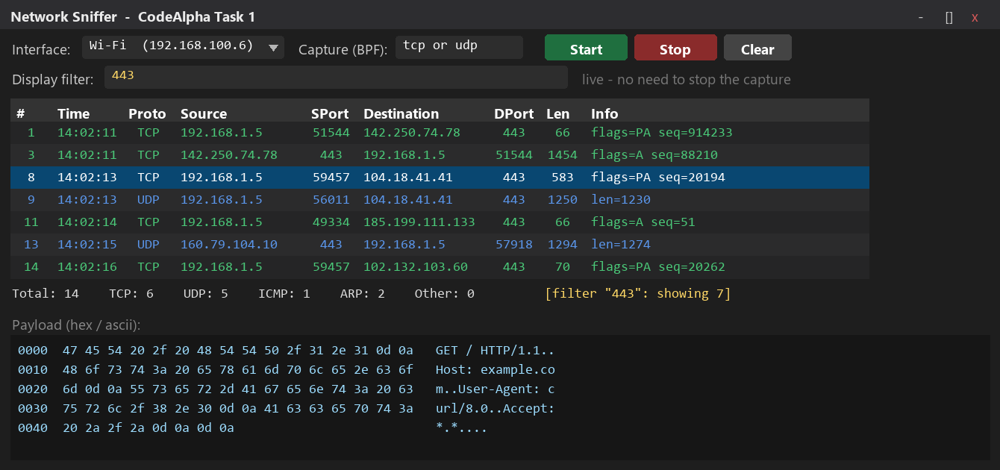
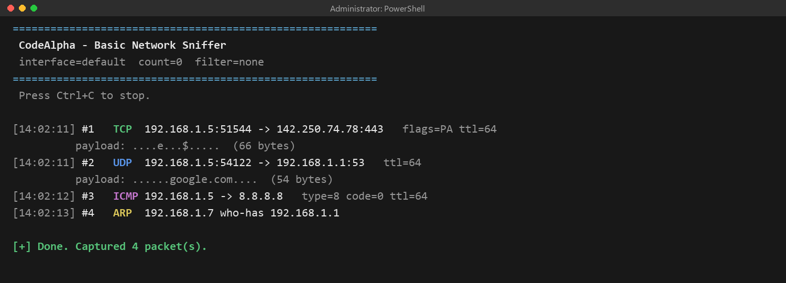

# 🛰️ Basic Network Sniffer

> **CodeAlpha Cyber Security Internship — Task 1**

A Python tool that captures **live network traffic** and shows the useful parts
of every packet — source/destination IPs, protocol, ports, TCP flags and a
payload preview — so you can actually *see* how data moves across a network.
It ships in two flavours: a **colour-coded command-line tool** and a
**graphical (GUI) app**.

Built with [Scapy](https://scapy.net) · Works on Windows, Linux & macOS · IPv4 + IPv6

---

## 📑 Table of Contents

- [Features](#-features)
- [Screenshots](#-screenshots)
- [Requirements](#-requirements)
- [Installation](#-installation)
- [Usage (CLI)](#-usage-cli)
- [Usage (GUI)](#-usage-gui)
- [How it works](#-how-it-works)
- [Documentation](#-documentation)
- [Project structure](#-project-structure)
- [Legal & ethical use](#-legal--ethical-use)

---

## ✨ Features

| | Feature |
|---|---|
| 🎯 | Captures live packets straight off the network interface |
| 🌐 | Decodes **IPv4, IPv6, TCP, UDP, ICMP and ARP** |
| 🎨 | **Colour-coded** output by protocol for fast scanning |
| 🔎 | Shows source/dest **IP : port**, TCP flags, TTL and ICMP type |
| 📦 | Readable **payload preview** (printable ASCII + byte count) |
| 🧪 | **BPF filters** (e.g. `tcp port 80`, `udp port 53`) |
| 💾 | Optional **logging to file** (`-o`) with colour codes stripped |
| 🖥️ | A full **Tkinter GUI** with a live table and hex/ASCII viewer |

---

## 🖼️ Screenshots

### Graphical version — `gui_sniffer.py`

A live, colour-coded packet table with per-protocol stats and a click-to-view
hex/ASCII payload pane.



### Command-line version — `sniffer.py`



---

## 🧩 Requirements

- **Python 3.8+**
- **Scapy** (`pip install scapy`)
- **Administrator / root** privileges (raw packet capture needs elevated rights)
- **Windows only:** [Npcap](https://npcap.com/) — install with *"WinPcap
  API-compatible mode"* ticked

---

## ⚙️ Installation

```bash
git clone https://github.com/<your-username>/CodeAlpha_BasicNetworkSniffer.git
cd CodeAlpha_BasicNetworkSniffer
pip install -r requirements.txt
```

---

## 🚀 Usage (CLI)

Run from an **elevated** terminal (Run as administrator on Windows, `sudo` on Linux/macOS):

```bash
python sniffer.py
```

### Options

| Flag | Description | Example |
|------|-------------|---------|
| `-i`, `--iface`  | Interface to listen on | `-i Wi-Fi` |
| `-c`, `--count`  | Stop after N packets (0 = run forever) | `-c 50` |
| `-f`, `--filter` | BPF capture filter | `-f "tcp port 80"` |
| `-o`, `--output` | Append a clean copy to a log file | `-o capture.log` |
| `--no-color`     | Plain output (good for redirects) | |

### Examples

```bash
python sniffer.py -c 50                      # capture 50 packets
python sniffer.py -f "tcp port 80 or tcp port 443"   # web traffic only
python sniffer.py -f "udp port 53"           # DNS only (readable domains)
python sniffer.py -o capture.log             # also save to a file
```

Press `Ctrl+C` to stop. A running total is printed at the end.

---

## 🖱️ Usage (GUI)

```bash
python gui_sniffer.py
```

The window gives you:

- A **live packet table**, colour-coded by protocol
  (TCP 🟢 · UDP 🔵 · ICMP 🟠 · ARP ⚪ · DNS 🟣)
- An **interface dropdown** that auto-lists your adapters with their IPs —
  no need to type a device name
- A **Capture (BPF) filter** applied when you press Start
- A **live Display filter** that filters the table **instantly as you type** —
  no need to stop the capture (e.g. type `443`, `dns`, `192.168` or `tcp`)
- **Start / Stop / Clear** buttons and a **live per-protocol counter**
- A **hex + ASCII payload viewer** that updates when you click a packet
- A **🛡 Run as Admin** button + startup prompt to relaunch elevated on Windows

Tkinter ships with Python, so there is nothing extra to install.

---

## 🔬 How it works

A packet is wrapped in layers, like envelopes inside envelopes. The sniffer
peels them from the outside in:

```
 Network  ──▶  NIC + Npcap  ──▶  Scapy sniff()  ──▶  process_packet()  ──▶  Console / log
 (the wire)    (copy packet)     (deliver)           (decode layers)        (readable output)
```

| Layer | What it holds | Where the code reads it |
|-------|---------------|--------------------------|
| L2 — Link | Ethernet / ARP (MAC addresses) | `haslayer(ARP)` |
| L3 — Network | IP / IPv6 (addresses, TTL) | `packet[IP]` / `packet[IPv6]` |
| L4 — Transport | TCP / UDP / ICMP (ports, flags) | `packet[TCP]` / `[UDP]` / `[ICMP]` |
| L7 — Application | the actual data | `packet[Raw].load` |

Packets are processed with `store=False`, so they are printed and discarded —
memory stays low even on busy networks.

---

## 📘 Documentation

[**`Sniffer_Explained.pdf`**](Sniffer_Explained.pdf) is an illustrated,
**line-by-line walkthrough of `sniffer.py`** — syntax-highlighted code
screenshots, a data-flow diagram, an "anatomy of an output line" breakdown and
a sample run.

Regenerate the docs at any time:

```bash
pip install fpdf2 pillow pygments
python make_explainer_pdf.py     # builds Sniffer_Explained.pdf
python make_screenshots.py       # rebuilds the docs/ screenshots
```

---

## 📂 Project structure

```
.
├── sniffer.py             # command-line sniffer (colour, IPv6, logging)
├── gui_sniffer.py         # Tkinter GUI version
├── requirements.txt       # runtime dependency (scapy)
├── Sniffer_Explained.pdf  # illustrated line-by-line walkthrough
├── make_explainer_pdf.py  # regenerates the PDF
├── make_screenshots.py    # regenerates the docs/ images
├── docs/
│   ├── gui_sniffer.png
│   └── cli_output.png
└── README.md
```

---

## ⚖️ Legal & ethical use

> Only capture traffic on networks you **own** or are **explicitly authorised**
> to monitor. Packet sniffing on networks without permission is illegal in most
> countries. This project is for **learning and authorised testing only**, as
> part of the CodeAlpha Cyber Security internship.
